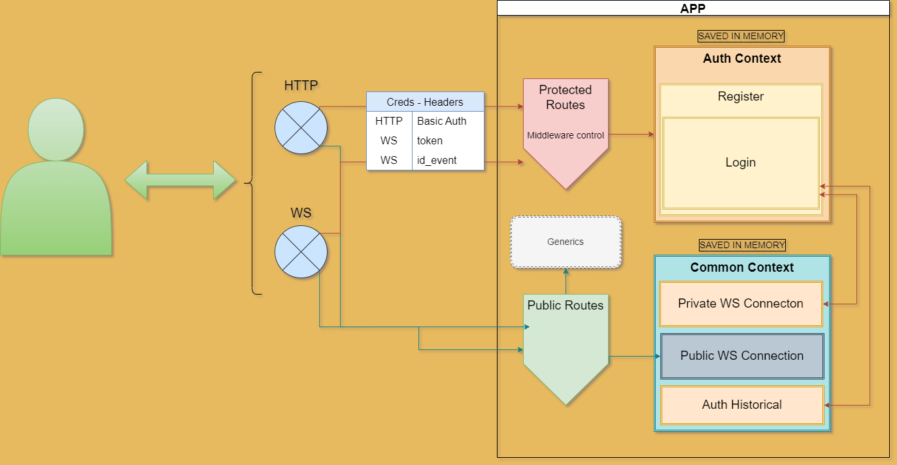

## CHALLENGE

### Tecnología

- NodeJs
- Typescript
- Express
- Websocket

### Herramientas

- Postman
- Newman
- Eslint
- Prettier
- Git
- winston

### ¿Cómo funciona?

> **Descripción** (VER IMAGEN ANEXA AL FINAL DEL DOCUMENTO) 

- A través del servicio podemos obtener información de mercado de criptoactivos, teniendo como fuente de datos a Bitfinex. Solo se trabajó sobre endpoints públicos provistos por el exchange. Se podrá conectar a cualquier criptodivisa y obtener información real time (websocket) de velas de precios, order book y tikers (Sobre lo cual fue testeado).
- A través del mismo puerto conectamos tanto con servicios websocket como realizar peticiones http. Podemos distinguir dos tipos de rutas: Públicas y Protegidas:

    - Rutas protegiadas: 

        - HTTP: Procesos de login - simular operaciones de compra/venta - cierre de operaciones - obtener historial de operaciones - logout.
        - WS: Conexión ws y registro sobre contexto de autenticación. Subscribir a información como order books, candles y tickers.

    - Rutas públicas:

        - HTTP: Obtener reporte de test. Este puede ser accedido por browser como se idica mas adelante para visualizar un ejemplo de testing. Registro, permite registrar un nuevo usuario y login.
        - WS: Conexión a ws. Suscribir a obtención de información como order books, candles y tickers.

- Para la demo se trabaja sin modelamiento y conexión con base de datos. Para suplantarlo se almacena la información directo en memoria. Para tal fin, se crean contextos globales al iniciar el servicio sobre las cuales se guarda informacion de conexión, tanto pública como privada, registros de usuarios, autenticación (login), subscripciones a eventos e historial de trades.

    - CONTEXTO PUBLICO: >> ANEXO 1.0 

        - Un usuario sin credenciales solo puede acceder a través de ws para suscribir a la información real time antes mecionada. Por WS no se debe enviar nada por headers. 
        - Al conectarse se le asigna un id de evento (id_event) y un id de conexión. El primero sirve para guardarlo como id único en el contexto de "Public WS Connection" dentro de "common context". 
        - La desconexión del servicio implica cerrar la suscripcion a eventos en Bitfinex y cierre de conexión con el servicio. En ese momento, la información registrada en common context del usuario es eliminado sin guardar registro.

    - CONTEXTO PRIVADO:  >> ANEXO 1.0

        - Para que pueda acceder a peticiones HTTP y conexión WS como usuario privado primero se debería registrar y luego realizar login. Al registrarse, la información es almacenada en el contexto de "rgister" en "auth context". 
        - Al realizar login, recibe un token que debe pasar por header en rutas protegidas(Basic auth) "Authorizarion: Bearer -token-" para http y "token: -token-" para ws. El login es registrado y almacenado en el contexto junto con la información otorgada. En el response se envía un token y un id_event, el cual debería ser utilizado en WS y pasarlo por header como id_event.
        - En este caso cuando el usuario se conecte a WS, esta es registrada y almacenada en el contexto de "private WS Connection" en "common context", utilizando el id_event como id único de conexión, a la vez que se otorga un id de conexión, de tal forma que, si el mismo usuario realiza una conexión paralela, cada una podrá almacenar procesos de suscripcion individuales identificadas por id de conexión y dentro del mismo registro de conexión a WS inicial por id_event. Si este es incorrecto, entonces la conexión no es factible.
        - Como usuario protegido, se pueden realizar peticiones http simulando trades de compra/venta sobre cualquier par. Esta "operación" luego puede ser cerrada a través de otro endpoint. El primero genera un id que debe ser utilizado en el segundo para cerrarlo, dando un resumen, este último, de la operación realizada. El primero registra la operación en el contexto de "hisotrical" dentro de common context, teniendo como key único el id de usuario. Dentro de ella, se almacenan todos los "trades" del usuario abiertas y cerradas, las cuales a través de un 3er endpoint pueden obtenerse como un "get de trades historicos". 
        - El procesos de logoun simplemente elimina la sesión del usuario, de forma que no se podrá volver a acceder sin antes hacer login. Se se da este último nuevamente, se comprueba que los registros se mantienen en memoria.
        
    - La información almacenada en memoria no tiene persistencia y se elimina cada vez que se reinicia el servicio.

> **Endpoints**

- /api/auth/register | POST
    - Verifica el contexto de registro
    - Verifica si el usuario existe en registro
    - Inserta Nuevo usuario
    - Encripta password
    - Devuelve error si el usuario ya existe o no se envian los datos requeridos
    - EJEMPLO REQUEST: POST
         
         
                ``curl --location 
                    'http://localhost:4000/api/auth/register' \
                    --header 'Content-Type: application/json' \
                    --data '{
                    "username": "test1",
                    "password": "test123*"
                    }'``

- /api/auth/signin | POST
    - Verifica si existe contexto de login
    - Verifica si el usuario existe dentro del contexto de registro
    - Verifica si el usuario ya se encuentra login
    - Crea contexto de login si no existe
    - Crea nueva sesion de usuario si no existe
    - Actualiza token de sesion si no existe
    - Crea token
    - EJEMPLO: POST
         
                ``curl --location 
                    'http://localhost:4000/api/auth/signin' \
                    --header 'Content-Type: application/json' \
                    --data '{
                    "username": "test1",
                    "password": "test123*"
                    }'``

- /api/auth/signout | GET
    - Previamente es testeado por el middleware de autenticacion
    - Requiere solo el envio de token basic auth
    - Verifica que exista contexto de login y que el usuario exista
    - Elimina sesion del contexto de login
    - EJEMPLO: GET

                ``curl --location 'http://localhost:4000/api/auth/signout' \
            --header 'Authorization: Bearer <token>'``

- /api/market/trade | POST
    - Se abre una operación de compra/venta
    - EJEMPLO: POST

            ``curl --location 'http://localhost:4000/api/market/trade' \
                --header 'Authorization: Bearer <token>' \
                --header 'Content-Type: application/json' \
                --data '{
                "amount": 0.122,
                "symbol": "BTCUSD",
                "operation": "buy"
            }'``

- /api/market/trade/:trade_id | GET
    - Se obtiene el registro de todas las opearciones abiertas y cerradas del usuario.
    - EJEMPLO: GET

            ``curl --location 'http://localhost:4000/api/market/trade/:trade_id' \
                --header 'Authorization: Bearer <token>'``

- /api/test_view | GET
    - Al inicializar la api se lleva a cabo un proceso de testing que puede ser observada en la consola del cliente, la cual tambien genera un reporte html, que puede accederse a traves de este endpoint desde el navegador.
    ``http://localhost:4000/api/test_view``

> **Conexión a WebSocket**

- /api/gateway
    - Publico:
        - no es necesario enviar nada por header.
        - Response connection:

                    {
                        "_id": "b1806674-f960-46e3-8d84-3e5f75fab6a1", -- => id_event
                        "connection": true
                        }
        - Envío de mensaje - Suscripción a order book:

                    {
                        "event": "subscribe",
                        "channel": "book",
                        "symbol": "BTCUSD"
                       }
        - Envío de mensaje - Subscripcion a precios de vela (candles):

                    
                    {
                            "event": "subscribe",
                            "channel": "candles",
                            "time_frame": "1m",
                            "symbol": "BTCUSD"
                        }
        - Envío de mensaje - Suscripcion a Tikers:

                    {
                            "event": "subscribe",
                            "channel": "ticker",
                            "symbol": "BTCUSD"
                        }                    

    - Conexión privada:

        - Idem a Publico sin embargo se debe enviar por header el token y el id_event.
            
                    token: <token>
                    id_event: <id_event>
        

> **Otras características**

- El testing se realiza sobre HTTP utilizando Postman y newman sobre el código. En la carpeta src/test_newman se encuentran los json exportados de Postman y la configuración basica de newman.
- Cuando se inicia el servidor, se ejecuta automaticamente el test, generando un reporte por consola y html el cual puede ser verificado en 
``http://localhost:4000/api/test_view``
- Se utiliza como formateador de codigo y control eslintrc y prettier.
- Se generan logs de error e información con winston.
- Enviroments se setean en src/infraestructure/server/envs

> **Instalación**
- Se debe tener NodeJs instalado.
- Si se requiere modificar enviroment:
    - src/infraestructure/server/envs/.env.local
- En consola y sobre la raíz del proyecto ejecutar:
    - Instalar:
        - ``npm install`` || ``npm install --force``
        - Recomendado pero no requerido: ``npm install -g newman``
        - Recomendado pero no requerido: ``npm install -g newman-reporter-html``
    - Ejecutar en local:
        -``npm run start:local``

> **Durante la iniciacón**

- Una vez inicializado se ejecuta automáticamente el test por newman y se genera el reporte html, el cual tambien es observado desde consola.

> **Consideraciones**

- Se puede importar los archicos .json de test_newman al postman donde se puede probar manualmente.

## Nota Final

- En lugar de utilizar testing uitario con Jest o Mocha - Chai, decidí implementar otras herramientas de testing y documentación que permiten controlar luego un proceso de CI/CD de forma automatica. 

## ANEXO

> **1.0**
